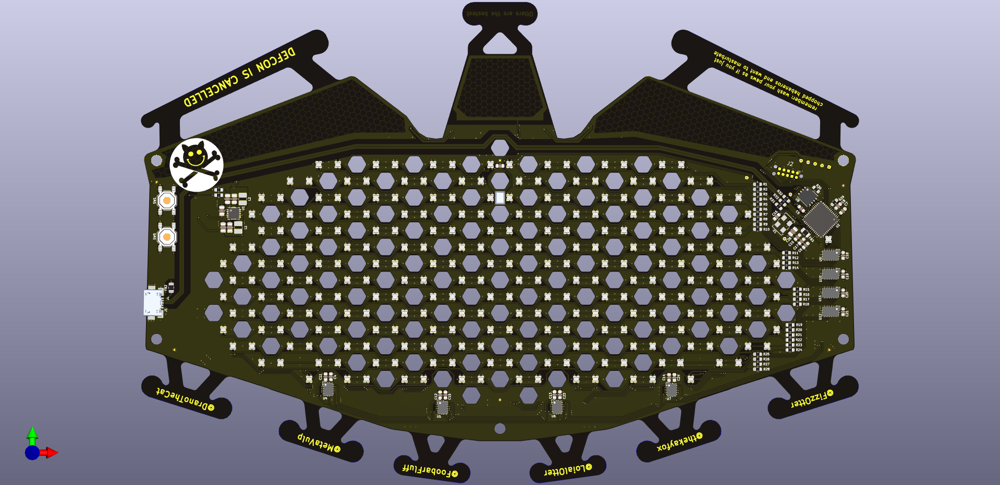

DEFCON Furs Badge Animations
============================

The 2020 DEFCON Furs badge, made in honor of DEF CON being cancelled. This year's badge takes the form of an mask that can be worn ontop of your PPE to add a bit
of bling.

### Features Include
 * Lattice iCE40 UltraPlus FPGA with 5k LUTs and 128kB of embedded memory.
 * 20x14 pixel RGB matrix display.
 * RISC-V soft core processor.
 * 64Mbit SPI flash to store animation programs.
 * MEMS microphone allows the badge to react to your voice.
 * Powered by micro-USB.
 * Animations, firmware, and the FPGA can all be upgraded using USB DFU.

### Further Reading
 * Source code for the FPGA and bootloaders are available on [GitHub](https://github.com/defconfurs/dc28-fur-fpga)
 * A beb-based tool for creating JSON animations URL TBD!

Building the Animations
-----------------------
The animations are programmed as RISC-V applications that are loaded by a
small runtime BIOS. To build animations, you will need to install a RISC-V
cross compiler. On Ubuntu 20.04 or later this can be accomplished by installing the `gcc-riscv64-unknown-elf` package. For older systems, prebuilt toolchains
can be downloaded from [SiFive](https://www.sifive.com/software)

To reprogram the badge with new animations, you will also need to install the
`dfu-util` package.

TODO: Document how to setup on Windows using PlatformIO.

To build the animations, you can use the `make.py` script to compile, link and
package the animations together into an image suitable to be programmed to the
user data partition in the flash. This script works like a Makefile, and will
rebuild only the animations that have changed. The compilation process is as
follows:

```
furry@trash:~/dcfurs-badge-dc28$ ./make.py build
BIOS [bios.bin] is up to date
Animation [lineface.bin] is up to date
Animation [djmode.bin] is up to date
Animation [mic-test.bin] is up to date
Animation [matrix.bin] is up to date
Animation [northern-lights.bin] is up to date
Animation [lightning-voice.bin] is up to date
Animation [rainbow-grin.bin] is up to date
Animation [marquee-image.bin] is up to date
Animation [rainbow.bin] building...
   Rendering [rainbow.json]
   Compiling [jsmain.c]
   Compiling [syscalls.c]
   Compiling [framebuf.c]
   Compiling [muldiv.c]
   Linking   [rainbow.elf]
   Packing   [rainbow.bin]
Animation [test.bin] is up to date
Bundling [animations.bin]
```

To clean your working directory, the `make.py` script can also be invoked with
the `clean` command to remove all compiled and generated files:

```
furry@trash:~dcfurs-badge-dc28$ ./make.py clean
Cleaning [bios]
Cleaning [animations.bin]
Cleaning [json]
Cleaning [animations.bin]
Cleaning [lineface]
Cleaning [djmode]
Cleaning [mic-test]
Cleaning [matrix]
Cleaning [northern-lights]
Cleaning [lightning-voice]
Cleaning [rainbow-grin]
Cleaning [marquee-image]
Cleaning [animations.bin]
```

The final command available in `make.py` is the `upload` command, which will
perform the DFU update process, and reboot the badge back into runtime mode
when the update is complete.
```
furry@trash:~dcfurs-badge-dc28$ ./make.py upload
dfu-util 0.9

Copyright 2005-2009 Weston Schmidt, Harald Welte and OpenMoko Inc.
Copyright 2010-2016 Tormod Volden and Stefan Schmidt
This program is Free Software and has ABSOLUTELY NO WARRANTY
Please report bugs to http://sourceforge.net/p/dfu-util/tickets/

dfu-util: Invalid DFU suffix signature
dfu-util: A valid DFU suffix will be required in a future dfu-util release!!!
Opening DFU capable USB device...
ID 26f3:1338
Run-time device DFU version 0110
Claiming USB DFU Interface...
Setting Alternate Setting #1 ...
Determining device status: state = dfuIDLE, status = 0
dfuIDLE, continuing
DFU mode device DFU version 0110
Device returned transfer size 256
Copying data from PC to DFU device
Download	[=========================] 100%       721920 bytes
Download done.
state(2) = dfuIDLE, status(0) = No error condition is present
Done!
Resetting USB to switch back to runtime mode
```

Animation Programming with C
--------------------------

TODO: Document Me!

Animation Programming with JSON
-------------------------------

TODO: Document Me!

Memory Layout and Boot Process
------------------------------

| Address    | Size   | Description
|------------|--------|--------------------------------------
| 0x00000000 | 4KiB   | BIOS and initial bootstrap code.
| 0x10000000 | 4KiB   | Stack memory
| 0x20000000 | 64KiB  | Animation code, RAM and heap memory.
| 0x30000000 | 8MiB   | Memory mapped QSPI flash (read only).
| 0x30000000 | 256KiB | Firstboot FPGA bitstream.
| 0x30040000 | 256KiB | USB-DFU bootloader bitstream.
| 0x30080000 | 256KiB | RISC-V application bitstream.
| 0x30100000 | 7MiB   | BIOS and animation data partition.
| 0x40000000 | 256B   | Miscellaneous peripheral block.
| 0x40010000 | 256B   | USB/UART peripheral block.
| 0x40020000 | 64KiB  | Frame buffer memory.

At initial power-on, the FPGA loads and begins to execute the firstboot
bitstream. This bitstream checks the status of the buttons, and selects
the next bitstream to be loaded. If the top button is held at boot, the
USB-DFU bootloader will be loaded, otherwise the RISC-V application
bitstream will be loaded.

After loading the RISC-V application bitstream, the BIOS memory will be loaded
with a small boot stub and the RISC-V processor will begin to execute from
address 0x00000000. This bootstub will check for an application image header
at the start of the BIOS and animation data partition. If found, the boot stub
will overwrite itself with the BIOS and jump to its entry point.

Once started, the BIOS will then manage the loading of animations out of the
QSPI flash and into RAM and executing them.

